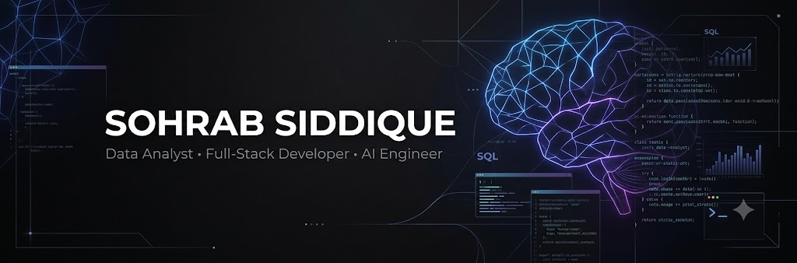
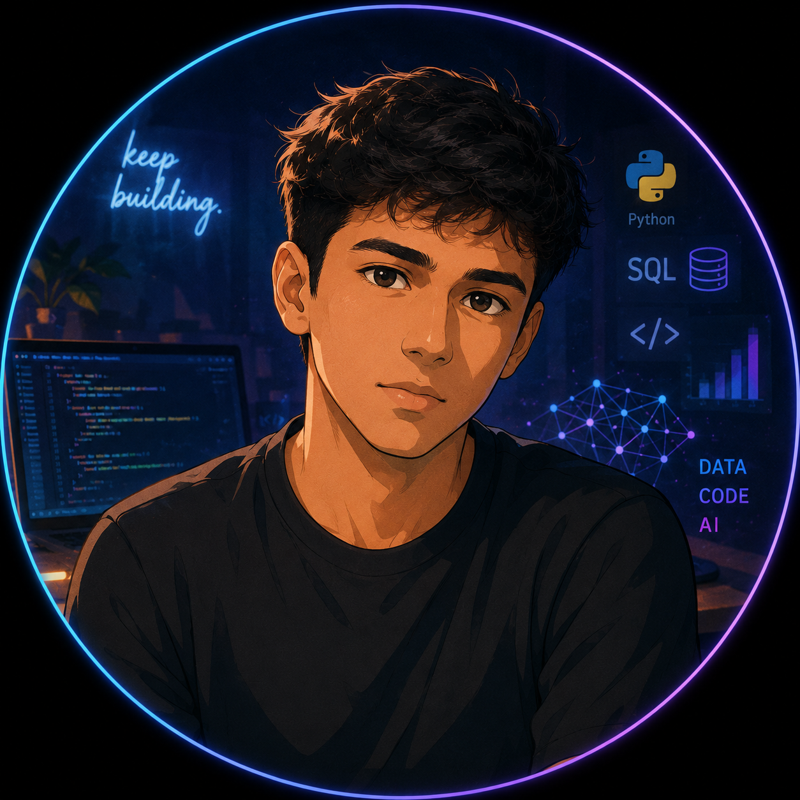
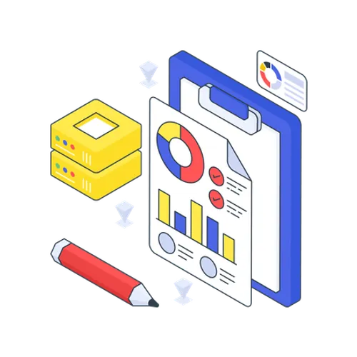

<div align="center">



# 👋 Hi, I'm Sohrab Siddique

### Data • AI/ML • Software Engineering

<p>
  
</p>

</div>

---

## 🧑‍💻 About Me

Hi, I'm **Sohrab** — a developer who enjoys learning by building practical projects.

I'm focused on **Data Analytics, Machine Learning, and Artificial Intelligence**, with a long-term goal of becoming a **production-oriented AI Engineer**.

My approach is to build a strong foundation in **Python, SQL, statistics, data analysis and machine learning**, and then progress toward **deep learning, Generative AI, LLMs, RAG, AI agents and production AI systems**.

I also use my **software engineering and full-stack development skills** to turn models and ideas into usable applications.

<div align="center">
  
</div>

### 🚀 What I'm Focused On

- 📊 **Data Analytics** — Python, SQL, Pandas, NumPy, statistics & visualization
- 🤖 **Machine Learning** — understanding algorithms, preprocessing, feature engineering & model evaluation
- 🧠 **Artificial Intelligence** — progressing toward Deep Learning, Generative AI & intelligent systems
- 🔎 **Data-Driven Problem Solving** — turning raw data into insights and useful solutions
- 💻 **Software Engineering** — building applications around data and AI systems
- 🚀 **Production AI** — eventually learning deployment, APIs, Docker, cloud & MLOps

---

## 📊 Data Analytics

<div align="center">
  
</div>

I'm building a strong foundation in **data analysis and statistics**, with an emphasis on understanding data before building models.

### 🔍 Areas I'm Developing

- Data cleaning & preprocessing
- Exploratory Data Analysis (EDA)
- Statistical analysis
- Data visualization
- SQL & relational databases
- Feature engineering
- Business and data-driven insights

**Current Tools:**

`Python` `SQL` `Pandas` `NumPy` `Matplotlib` `Statistics`

---

## 🤖 AI & Machine Learning

My primary long-term direction is **Artificial Intelligence and Machine Learning**.

I'm working toward understanding the complete journey from raw data to production-ready AI systems.

### 🧠 Learning Path

```text
Python
   ↓
DSA + Problem Solving
   ↓
SQL + Databases
   ↓
Data Analysis + Statistics
   ↓
Machine Learning
   ↓
Deep Learning
   ↓
PyTorch
   ↓
Generative AI + LLMs
   ↓
Embeddings + Vector Databases
   ↓
RAG Systems
   ↓
AI Agents
   ↓
AI Applications + APIs
   ↓
Docker + Cloud
   ↓
MLOps / LLMOps
   ↓
Production AI Engineering
