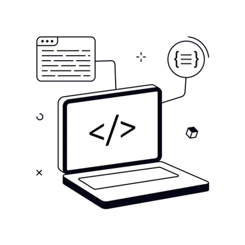
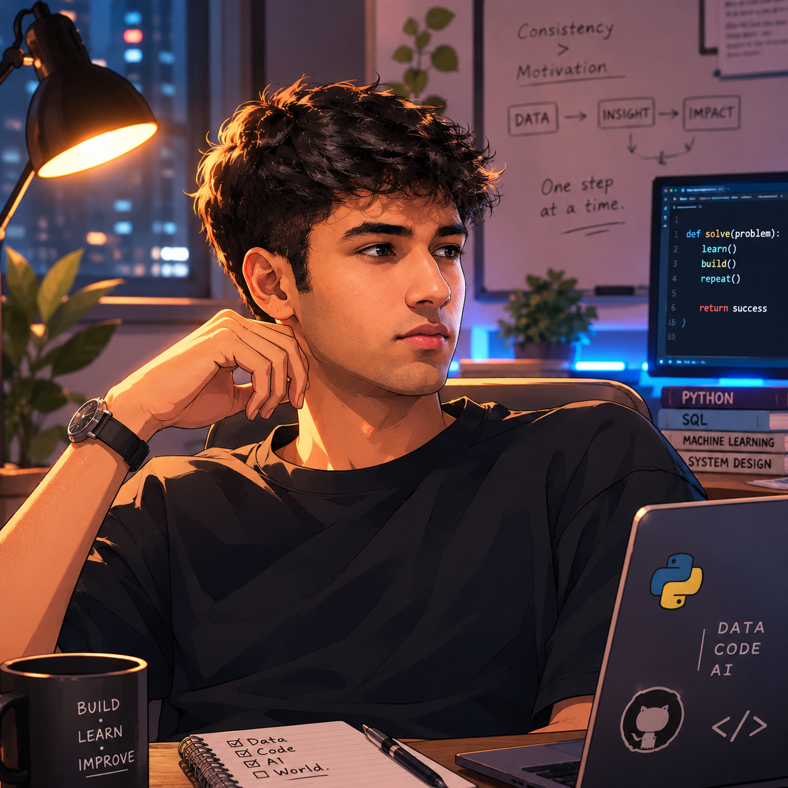

<div align="center">


# 👋 Hi, I'm Sohrab Siddique

### Aspiring Data Analyst • Full-Stack Developer • AI/ML Enthusiast

<p>
  
</p>

</div>

---

## 🧑‍💻 About Me

Hi, I'm **Sohrab** — a developer who enjoys learning by building.

I'm currently developing my skills across **Data Analytics, Full-Stack Development, and Machine Learning**, with a long-term goal of becoming a **production-oriented AI Engineer**.

I like working on practical projects where I can take an idea from **data and logic → code → application → deployment**.

<div align="center">
  
</div>

### 🚀 What I'm Focused On

- 📊 **Data Analytics** — Python, SQL, Pandas, NumPy, statistics & visualization
- 💻 **Full-Stack Development** — building practical web applications and APIs
- 🤖 **AI / Machine Learning** — learning ML fundamentals and progressing toward modern AI systems
- 🧠 **Problem Solving** — improving programming, DSA and software engineering fundamentals
- 🛠️ **Building** — turning concepts into real, usable projects

---

## 📊 Data Analytics

<div align="center">
  
</div>

I'm building a strong foundation in data analysis and learning how to turn raw data into useful insights.

**Currently working with:**

`Python` `SQL` `Pandas` `NumPy` `Matplotlib` `Statistics`

---

## 💻 Full-Stack Development

<div align="center">
  
</div>

Alongside analytics and AI, I'm actively working on **full-stack projects** — building interfaces, backend logic, APIs, databases, authentication and real-world application workflows.

**Areas I'm developing:**

`HTML` `CSS` `JavaScript` `React` `Node.js` `REST APIs` `Databases` `Git`

---

## 🤖 AI & Machine Learning

My current path is:

```text
Python
   ↓
DSA + SQL
   ↓
Data Analysis + Statistics
   ↓
Machine Learning
   ↓
Deep Learning / PyTorch
   ↓
Generative AI & LLMs
   ↓
RAG + Embeddings + Vector Databases
   ↓
AI Agents
   ↓
Production AI / MLOps
```

The goal is not just to train models, but to eventually understand how to **build, integrate, deploy and maintain useful AI systems**.

---

## 🛠️ Tech Stack

### 🐍 Languages & Data

<p>
  
  
  
</p>

### 📊 Data & Machine Learning

<p>
  
  
  
  
</p>

### 🌐 Full-Stack

<p>
  
  
  
</p>

### ⚙️ Tools

<p>
  
  
</p>

---

## 🚀 Featured Projects

> This section is intentionally ready for your strongest projects. Add repositories here as they are polished and recruiter-ready.

| Project | Description | Focus |
|---|---|---|
| 🌱 **Crop Recommendation Model** | Machine learning project focused on recommending suitable crops from agricultural data. | `Python` `ML` `Scikit-learn` |
| 🖨️ **GetYourPrint** | Full-stack printing platform involving frontend, backend, database and payment workflows. | `Full-Stack` `Database` `Payments` |
| 🌐 **Web Projects** | Practical websites and applications built while developing full-stack skills. | `React` `JavaScript` `APIs` |

---

## 🎯 Currently Learning

```text
☑ Python fundamentals
☑ SQL & databases
☑ Data analysis
☑ Machine learning fundamentals
☑ Full-stack development

→ DSA & problem solving
→ Statistics for data science
→ Deep learning
→ PyTorch
→ Generative AI / LLMs
→ RAG & vector databases
→ AI agents
→ Docker, cloud & MLOps
```

---

## 📈 GitHub Stats

<div align="center">


</div>

<br/>

<div align="center">
  
</div>

---

## 🤝 Open To

- 💡 Interesting project collaborations
- 🧑‍💻 Full-stack development opportunities
- 📊 Data / analytics projects
- 🤖 Machine learning & AI projects
- 📚 Learning with other developers
- 💬 Constructive feedback and ideas

---

## 📫 Let's Connect

<div align="center">

<a href="https://www.linkedin.com/in/sohrab-siddique-7004a130a/">
  
</a>
&nbsp;
<a href="mailto:sksohrabsiddique123@gmail.com">
  
</a>

</div>

---

<div align="center">



### ✨ Learning. Building. Improving.

*One project, one problem, and one line of code at a time.*

</div>
